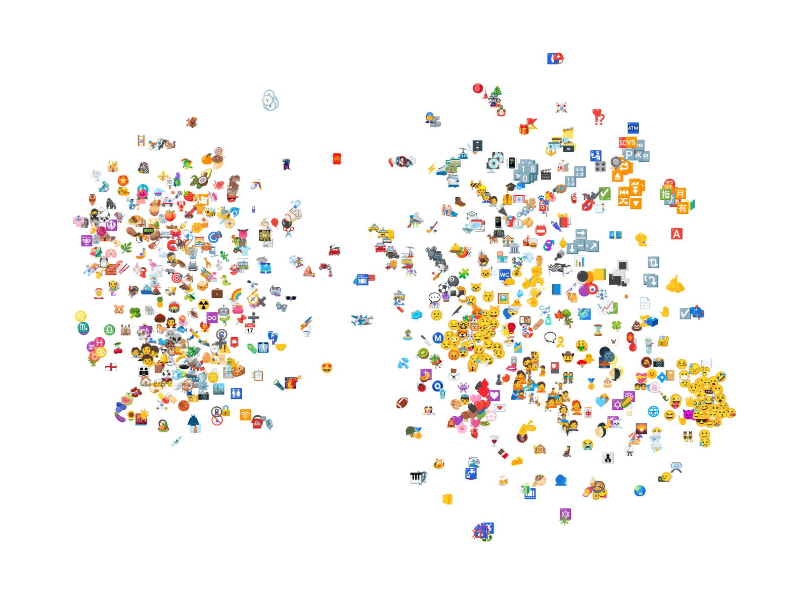

What does it look like when you group similar emojis on a 2D graph

# v0

The image above is t-SNE applied to the semantic representations of 1000 randomly-selected emoji from 2304 possible (skin-tone emojis omitted).

# dev stuff
## v0
in `v0`, run `source dev_setup.sh`. This installs a code linter [ruff](https://github.com/astral-sh/ruff) for pre-commit checks

Place huggingface API token in `.env` file

### testing
`coverage run -m pytest  -v -s && coverage report -m`
for unit tests coverage must be above 0.9

[excluding code coverage](https://coverage.readthedocs.io/en/latest/excluding.htmlhttps://coverage.readthedocs.io/en/latest/excluding.html)
